====================
Example Applications
====================

Example 1 - End-valve Closure
-----------------------------

This example shows how to simulate the closure of
valve located at the boundary of a network. The first example
network is shown below in :numref:`tnet1`. It comprises 9 pipes,
5 junctions, one reservoir, 3 closed loops,and one valve located
at the downstream end of the system. There are five steps that the
application would need to take:

.. _tnet1:
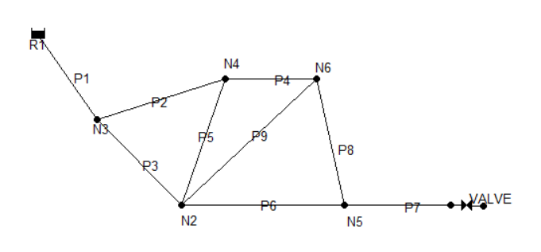

1.  Import wmoc package and read the Epanet .inp file.

.. literalinclude:: ../examples/Tnet1_valve_closure.py
    :lines: 1-4

2.  Set wave speed for all pipes to be :math:`1200m/s`,
    time step to be :math:`0.1s`, and simulation period
    to be :math:`60s`.

.. literalinclude:: ../examples/Tnet1_valve_closure.py
    :lines: 6-11

3.  Set valve operation rules, including how long it takes
    to close the valve (:math:`tc`), when to start close the
    valve (:math:`ts`), the open percentage when the closure
    is completed (:math:`se`), and the shape of the closure
    operation curve (:math:`m`, :math:`1` stands for linear closure,
    :math:`2` stands for quadratic closure).

.. literalinclude:: ../examples/Tnet1_valve_closure.py
    :lines: 13-19

4.  Compute steady state results to establish the initial
    condition for transient simulation.

.. literalinclude:: ../examples/Tnet1_valve_closure.py
    :lines: 21-24

5. Run transient simulation.

.. literalinclude:: ../examples/Tnet1_valve_closure.py
    :lines: 26-27

After the transient simulation, the results at nodes and links
will be returned and stored in the transient model (tm) instance.
The time history of flow rate on the start node of pipe P2
throughout the simulation can be retrieved by:

>>> print(tm.links['P2'].start_node_flowrate)

To plot the head results at N3:

.. literalinclude:: ../examples/Tnet1_valve_closure.py
    :lines: 32-42

yields :numref:`tnet1_node`:

.. _tnet1_node:
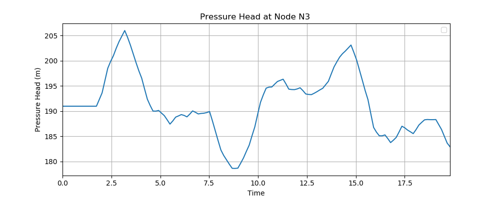

   Head at node N3.

Similarly, to plot the flow rate results in pipe P2:

.. literalinclude:: ../examples/Tnet1_valve_closure.py
    :lines: 45-58

yields :numref:`tnet1_pipe`:

.. _tnet1_pipe:
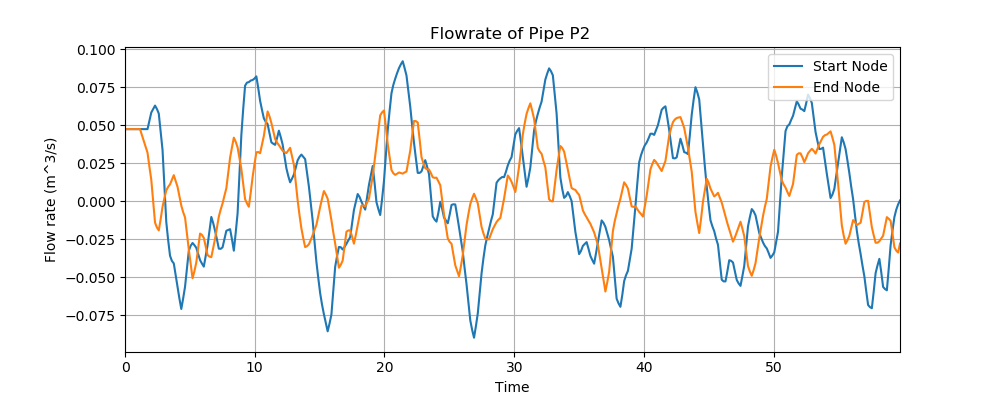

   Flow rate at the start and end node of pipe P2.

Example 2 - Pump operations
---------------------------

This example illustrates how the package models a controlled pump shutdown
transient event, indicating that the pump speed is ramped down. This example
network is shown below in :numref:`tnet2`. It comprises 113 pipes,
91 junctions, one valve, two pumps, two reservoir, and three tanks.
A transient simulation of 50 second with :math:`0.0125s`time step, generated
by shut down PUMP2, takes around 8 minutes in this network.There are five
steps that the application would need to take:

.. _tnet2:
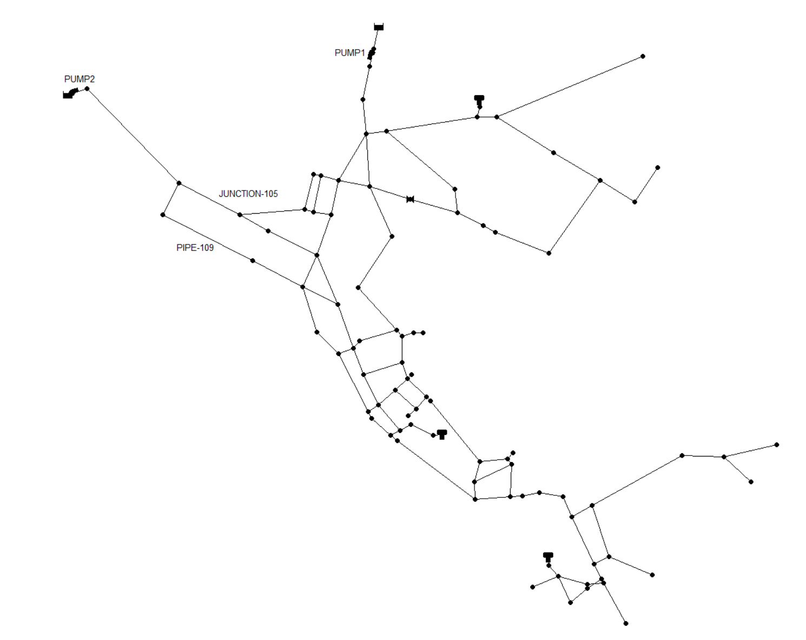

1.  Import wmoc package and read the Epanet .inp file.

.. literalinclude:: ../examples/Tnet2_pump_shutdown.py
    :lines: 1-4

2.  Set wave speed for all pipes to be :math:`1200m/s` and
    simulation period to be :math:`50s`. Use suggested time
    step.

.. literalinclude:: ../examples/Tnet2_pump_shutdown.py
    :lines: 6-10

3.  Set pump operation rules, including how long it takes
    to shutdown the pump (:math:`tc`), when to the shut-down starts
    (:math:`ts`), the pump speed multiplier value when the shut-down
    is completed (:math:`se`), and the shape of the shut-down
    operation curve (:math:`m`, :math:`1` stands for linear closure,
    :math:`2` stands for quadratic closure).

.. literalinclude:: ../examples/Tnet2_pump_shutdown.py
    :lines: 12-18

4.  Compute steady state results to establish the initial
    condition for transient simulation.

.. literalinclude:: ../examples/Tnet2_pump_shutdown.py
    :lines: 20-23

5. Run transient simulation.

.. literalinclude:: ../examples/Tnet2_pump_shutdown.py
    :lines: 25-26

After the transient simulation, the results at nodes and links
will be returned and stored in the transient model (tm) instance.
The actual demand discharge at JUNCTION-105 throughout the simulation
can be retrieved by:

>>> print(tm.nodes['JUNCTION-105'].demand_discharge)

To plot the head results at JUNCTION-105:

.. literalinclude:: ../examples/Tnet2_pump_shutdown.py
    :lines: 31-41

yields :numref:`tnet2_node`:

.. _tnet2_node:
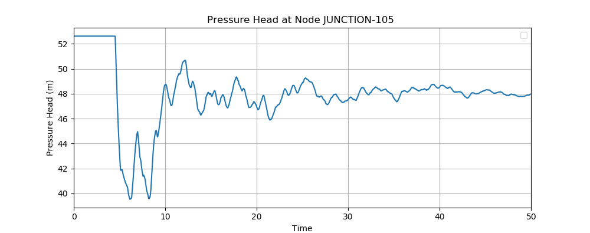

   Head at node JUNCTION-105.

Similarly, to plot the velocity results in PIPE-109:

.. literalinclude:: ../examples/tnet2_node.py
    :lines: 44-55

yields :numref:`tnet2_pipe`:

.. _tnet2_pipe:
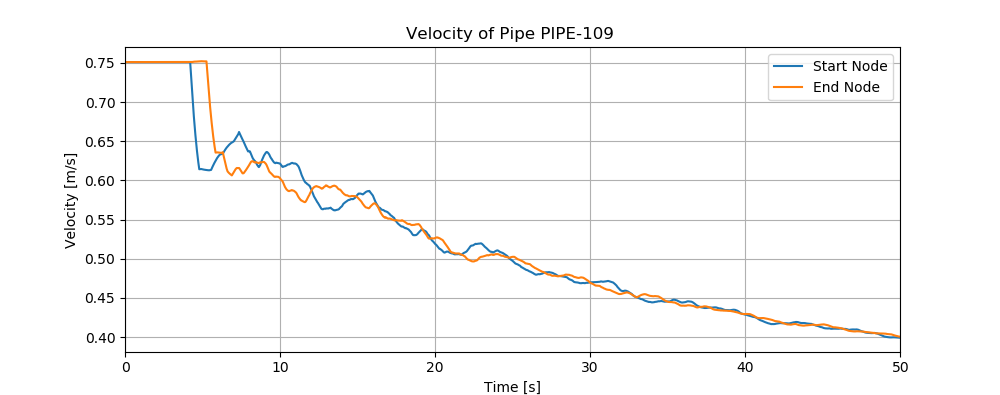

   Velocity at the start and end node of PIPE-109.

Example 3 - Burst and leak
---------------------------

This example reveals how wmoc simulate pipe bursts and leaks.This example
network is shown below in :numref:`tnet3`. It comprises 168 pipes,
126 junctions, 8 valve, two pumps, one reservoir, and two tanks. The runtime
is around 7 minutes for a transient simulation of :math:`20s` with a time
step of :math:`0.00625s`.There are five steps that the application
would need to take:

.. _tnet3:
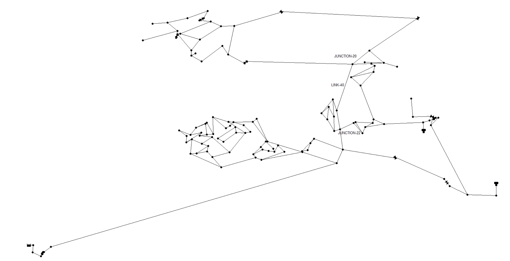

1.  Import wmoc package and read the Epanet .inp file.

.. literalinclude:: ../examples/Tnet3_burst_leak.py
    :lines: 1-4

2.  Assume that the wave speed for the pipes is normally distributed
    with mean equal to :math:`1200 m/s` and standard deviation equal
    to :math: `100m/s`. Then, assign the randomly generated wave speed
    to each pipe in the network according to the order the pipes are
    defined in the .inp file. Subsequently, set the simulation period
    as :math:`20s`, and use suggested time step.

.. literalinclude:: ../examples/Tnet3_burst_leak.py
    :lines: 6-12

3.  Define background leak, and specify the emitter coefficient.
    The leak will be included in the initial condition calculation.

.. literalinclude:: ../examples/Tnet3_burst_leak.py
    :lines: 14-16

4.  Set up burst event, including burst start time (:math:`ts`),
    time for burst to fully develop (:math:`tc`), and the final emitter
    coefficient (final_burst_coeff).

.. literalinclude:: ../examples/Tnet3_burst_leak.py
    :lines: 18-22

4.  Compute steady state results to establish the initial
    condition for transient simulation.

.. literalinclude:: ../examples/Tnet3_burst_leak.py
    :lines: 24-27

5. Run transient simulation.

.. literalinclude:: ../examples/Tnet3_burst_leak.py
    :lines: 29-30

After the transient simulation, the results at nodes and links
will be returned and stored in the transient model (tm) instance.

To understand how much water has been lost through the leakage
at JUNCTION-22, we can plot the leak discharge results at JUNCTION-22:

.. literalinclude:: ../examples/Tnet3_burst_leak.py
    :lines: 33-44

yields :numref:`tnet3_leak`:

.. _tnet3_node:
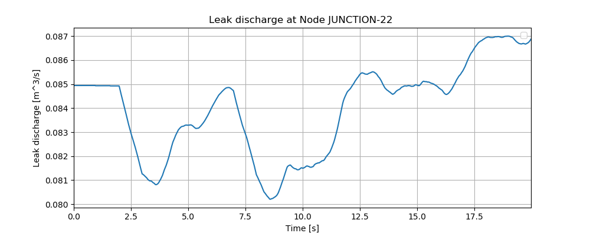

   Leak discharge at node JUNCTION-22.

Similarly, to understand how much water has been lost through the burst
at JUNCTION-20, we can plot the burst discharge results at JUNCTION-20:

.. literalinclude:: ../examples/Tnet3_burst_leak.py
    :lines: 47-57

yields :numref:`tnet3_burst`:

.. _tnet3_burst:
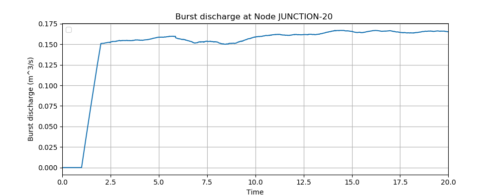

   Burst discharge at node JUNCTION-20.

Additionally, to plot the velocity results in LINK-40:

.. literalinclude:: ../examples/Tnet3_burst_leak.py
    :lines: 61-72

yields :numref:`tnet3_pipe`:

.. _tnet3_pipe:
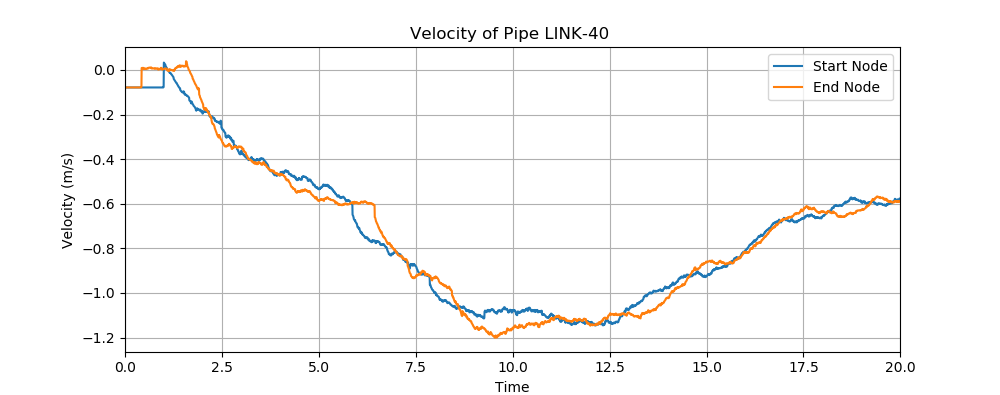

   Velocity at the start and end node of LINK-40.

Moreover, we can plot head results at some further nodes, such as
JUNCTION-8, JUNCTION-16, JUNCTION-45, JUNCTION-90, by:

.. literalinclude:: ../examples/Tnet3_burst_leak.py
    :lines: 75-90

The results are shown in :numref:`tnet3_multi`. It can be noticed that
the amplitude of the pressure transient at JUNCTION-8 and JUNCTION-16
is more significant than that at other two junctions, since they are closer
to JUNCTION-20, where the burst occurred.

.. _tnet3_multi:
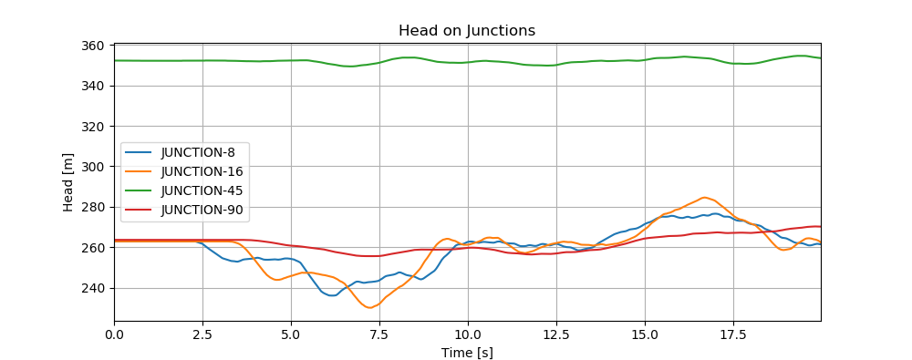

   Head at multiple junctions.
