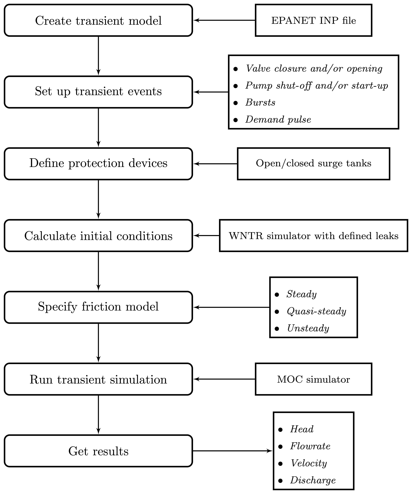
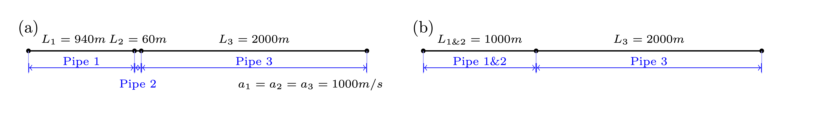
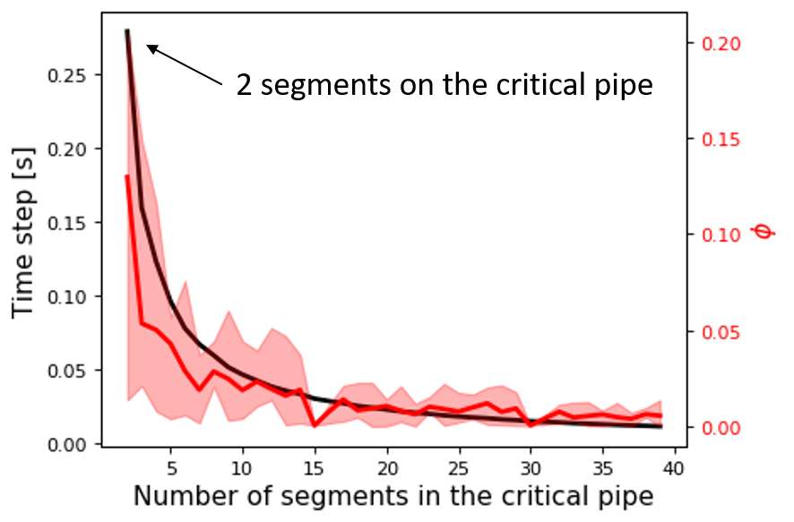
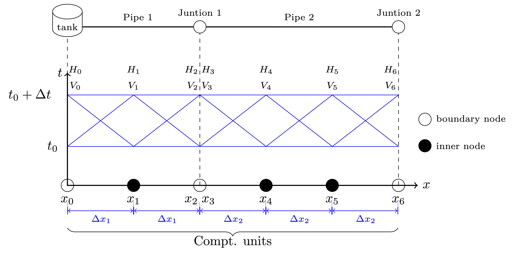
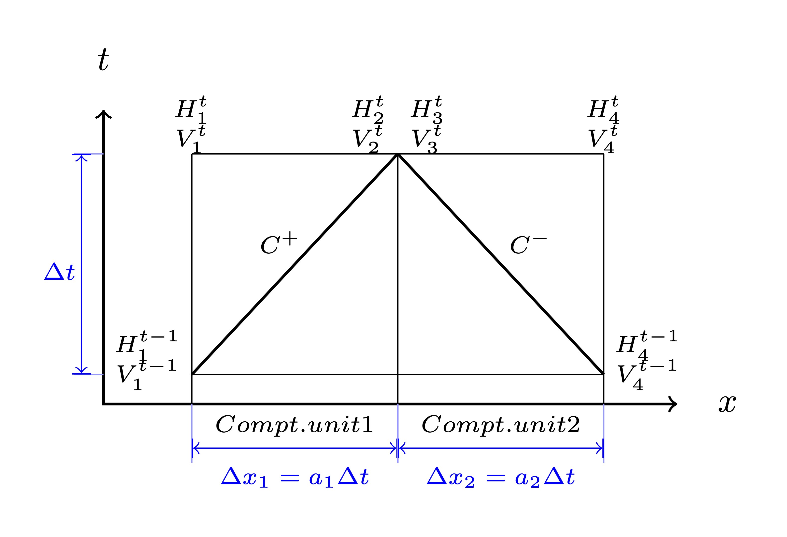
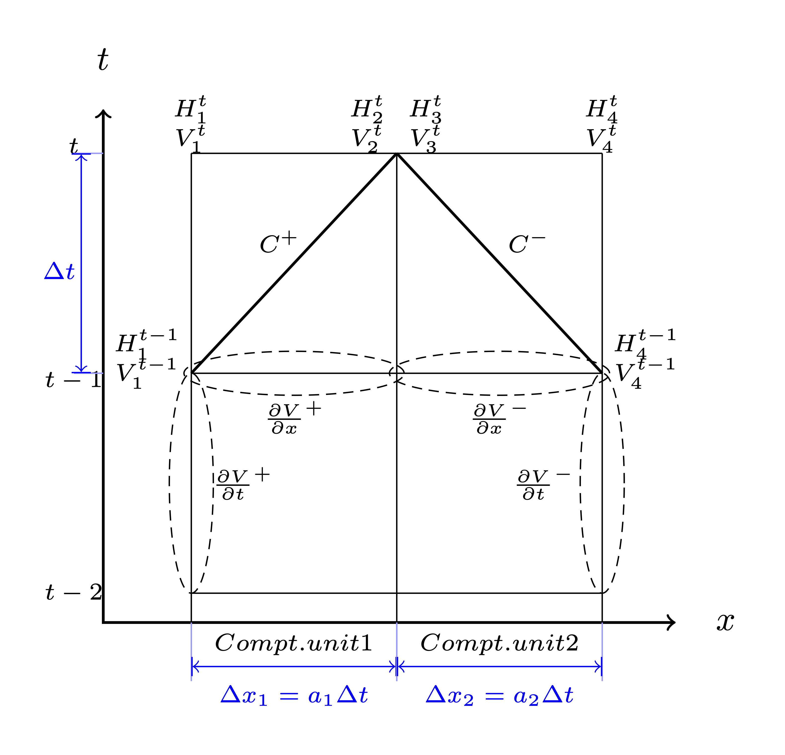
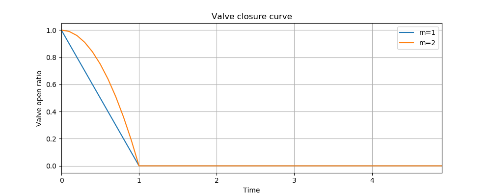
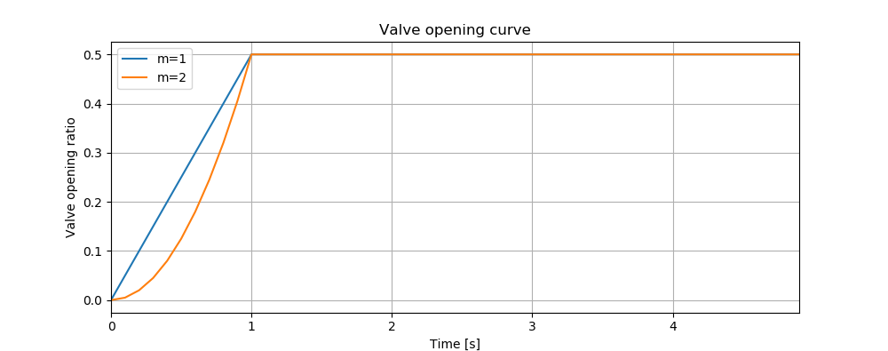
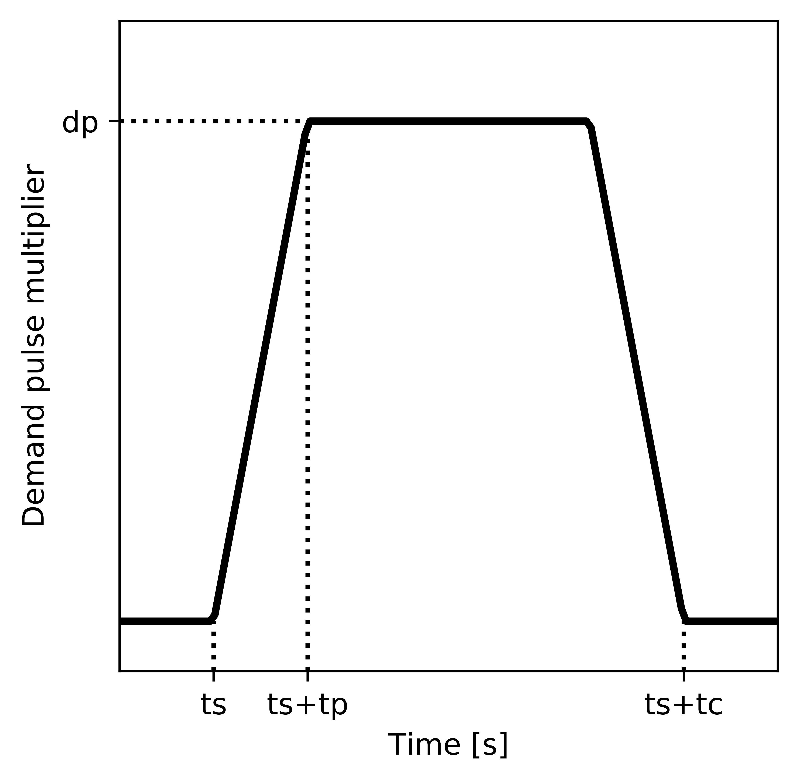

==================================
Transient Modeling Framework
==================================
The framework of performing transient simulation using TSNet is shown in :numref:`flowchart`
The main steps of transient modelling and simulation in TSNet
are described in subsequent sections.

.. _flowchart:

   Flowchart of transient simulation in TSNet

Transient Model
---------------

The transient model inherits the
WNTR water network model [WNTRSi]_,
which includes
junctions, tanks, reservoirs, pipes, pumps, valves,
patterns,
curves,
controls,
sources,
simulation options,
and node coordinates.
It can be built directly from an EPANet INP file.
Sections of EPANet INP file that are not compatible with WNTR are
described in [WNTRSi]_.

Compared with WNTR water network model,
TSNet transient model adds the features
designed specifically for transient simulation, such as
spatial discretization,
temporal discretization,
valve operation rules,
pump operation rules,
burst opening rules,
surge tanks, and
storage of time history results.
For more information on the water network model, see
:class:`~tsnet.network.model.TransientModel` in the API documentation.

A transient model can be created directly from an EPANET INP file.
The following example build a transient model.

.. code:: python

    inp_file = 'examples/networks/Tnet1.inp'
    tm = tsnet.network.TransientModel(inp_file)

Initial Conditions
------------------

TSNet employed WNTR [WNTRSi]_ for simulating the steady state
in the network to establish the initial conditions for
the upcoming transient simulations.

**WNTRSimulators** can be used to run demand-driven (DD) or
pressure-dependent demand (PDD) hydraulics simulations, with the
capacity of simulating leaks. The default simulation engine is DD.
An initial condition simulation can be run using the following code:

.. code:: python

    t0 = 0. # initialize the simulation at 0 [s]
    engine = 'DD' # demand driven simulator
    tm = tsnet.simulation.Initializer(tm, t0, engine)

:math:`t_0` stands for the time when the initial condition will be
calculated. More information on the initializer can be found in
the API documentation, under
:class:`~tsnet.simulation.initialize.Initializer`.

Transient Simulation
---------------------------------

After the initial conditions are obtained, TSNet adopts
the Method of Characteristics (MOC)
for solving governing transient flow equations.
A transient simulation can be run using the following code:

.. code:: python

    results_obj = 'Tnet1' # name of the object for saving simulation results
    tm = tsnet.simulation.MOCSimulator(tm, results_obj)

The results will be returned to the transient model (tm) object,
and then stored in the 'Tnet1.obj' file for the easiness of retrieval.

In the following sections, an overview of the solution approaches
and boundary conditions is presented,
based on the following literature [LAJW99]_ , [MISI08]_, [WYSS93]_.

Governing Equations
""""""""""""""""""""""""""""""""""""""""""

Mass and Momentum Conservation
^^^^^^^^^^^^^^^^^^^^^^^^^^^^^^

The transient flow is governed by the mass and momentum conservation
equation [WYSS93]_:

.. math::
    \frac{\partial H}{\partial t} + \frac{a^2}{g} \frac{\partial V}{\partial x} - gV\sin \alpha = 0

    \frac{1}{g}\frac{\partial V}{\partial t} + \frac{\partial H}{\partial x} + h_f = 0

where
:math:`H` is the head,
:math:`V` is the flow velocity in the pipe,
:math:`t` is time,
:math:`a` is the wave speed,
:math:`g` is the gravity acceleration,
:math:`\alpha` is the pipe slope,
and :math:`h_f` represents the head loss per unit length due to friction.

Method of Characteristics (MOC)
^^^^^^^^^^^^^^^^^^^^^^^^^^^^^^^

The Method of Characteristics (MOC) method is used to solve the system of
governing equations above. The essence of MOC is to transform the set of
partial differential equations to an equivalent set of ordinary differential
equations that apply along specific lines, i.e., characteristics lines
(C+ and C-), as shown below [LAJW99]_:

.. math::
    C+: \ \ \ \frac{dV}{dt} + \frac{g}{a} \frac{dH}{dt} + g h_f - \frac{g}{a}V\sin\alpha = 0
   \ \  \  \text{  along  } \frac{dx}{dt} = a

    C-: \ \  \  \frac{dV}{dt} - \frac{g}{a} \frac{dH}{dt} + g h_f - \frac{g}{a}V\sin\alpha = 0
   \ \  \ \text{  along  } \frac{dx}{dt} = -a

Headloss in Pipes
^^^^^^^^^^^^^^^^^

Steady/ quasi-steady friction model
~~~~~~~~~~~~~~~~~~~~~~~~~~~~~~~~~~~
TSNet adopts Darcy-Weisbach equation to compute head loss, regardless of the
friction method defined in the EPANET .inp file. This package computes
Darcy-Weisbach coefficients (:math:`f`) based on the head loss per unit length
(:math:`{h_f}_0`) and flow velocity (:math:`V_0`) in initial condition,
using the following equation:

.. math::
    f = \frac{{h_f}_0}{V_0^2/2gD}

where
:math:`D` is the pipe diameter,
and :math:`g` is gravity acceleration.

Subsequently, in transient simulation the headloss (:math:`h_f`) is calculated
based on the following equation:

.. math::
    h_f = f\frac{V^2}{2gD}

Unsteady friction model
~~~~~~~~~~~~~~~~~~~~~~~

In addition to the steady friction model, we incorporated the quasi-steady and
the unsteady friction models in the updated version of TSNet
The head loss term (:math:`h_f`) can be expressed as a sum of steady/quasi-steady part
(:math:`{h_f}_s`) and unsteady part (:math:`{h_f}_u`), i.e., :math:`h_f={h_f}_s+ {h_f}_u`.
TSNet incorporated the instantaneous acceleration-based model [VIBS06]_ to calcualte the
unsteady friction:

.. math::
    {h_f}_u = \frac{k_u}{2g} \left( \frac{\partial V}{\partial t} + a \cdot \mbox{sign}(V) \left| \frac{\partial V}{\partial x}\right| \right)

where
:math:`{h_f}_u` is the head loss per unit length due to unsteady friction,
:math:`\frac{\partial V}{\partial t}` is the local instantaneous acceleration,
:math:`\frac{\partial V}{\partial x}` is the convective instantaneous acceleration, and
:math:`k_u` is Brunone's friction coefficient, which can be analytically determined using
Vardy's sheer decay coefficient (:math:`C^*`) [VABR95]_:

.. math::
    k_u = \frac{C^*}{2}

.. math::
    C^* = \left\{ \begin{array}{rl}
        0.00476 & \mbox{laminar flow } (Re \leq 2000)\\
        \frac{7.41}{Re^{\log{(14.3/Re^{0.05})}}} & \mbox{turbulent flow } (Re > 2000)
    \end{array} \right.

TSNet allows the user to choose the friction model using TSNet API simply by specifying
the friction model to be used in \texttt{tsnet.simulation.MOCSimulator}, as illustrated
in Listing~\ref{lst:friction1}.
The friction argument can take three values: 'steady', 'quasi-steady', and 'unsteady'.}

.. code:: python

    results_obj = 'Tnet3' # name of the object for saving simulation results
    friction = 'unsteady' # or "steady" or "quasi-steady"
    tm = tsnet.simulation.MOCSimulator(tm, results_obj, friction)

Pressure-driven Demand
^^^^^^^^^^^^^^^^^^^^^^^

During the transient simulation in TSNet, the demands are treated as
pressure-dependent discharge; thus, the actual demands will vary from
the demands defined in the INP file.
The actual demands (:math:`d_{actual}`) are modeled based on the
instantaneous pressure head at the node and the demand discharge coefficients,
using the following equation:

.. math::
    d_{actual} = k \sqrt{H_p}

where :math:`H_p` is the pressure head
and :math:`k` is the demand discharge coefficient,
which is calculated from the initial demand (:math:`d_0`)
and pressure head (:math:`{H_p}_0`):

.. math::
    k = \frac{d_0}{\sqrt{{H_p}_0}}

It should be noted that if the pressure head is negative,
the demand flow will be treated zero,
assuming that a backflow preventer is installed on each node.

Choice of Time Step
"""""""""""""""""""

The determination of time step in MOC is not a trivial task. There are two
constraints that have to be satisfied simultaneously:

1.  The Courant's criterion has to be satisfied for each pipe,
    indicating the maximum time step allowed in the network transient analysis
    will be:

.. math::
    \Delta t \leqslant \min{\left(\frac{L_i}{N_i a_i}\right)} \text{,       }
    i = 1 \text{, } 2 \text{, ..., } n_p

2.  The time step has to be the same for all the pipes in the network, therefore
    restricting the wave travel time :math:`\frac{L_i}{N_ia_i}` to be the same
    for any computational unit in the network. Nevertheless, this is not
    realistic in a real network, because different pipe lengths
    and wave speeds usually cause different wave travel times. Moreover,
    the number of sections in the :math:`i^{th}` pipe (:math:`N_i`) has to
    be an even integer due to the grid configuration in MOC; however, the
    combination of time step and pipe length is likely to produce
    non-integer value of :math:`N_i`, which then requires further adjustment.

This package adopted the wave speed adjustment scheme  [WYSS93]_ to make
sure the two criterion stated above are satisfied.

To begin with, the maximum allowed time step (:math:`{\Delta t}_{max}`) is
calculated, assuming that there are two computational units
on the critical pipe (i.e., the pipe that results in the smallest travel time,
which depends on the length and the wave speed for that pipe):

.. math::
    \Delta t_{max} = \min{\left(\frac{L_i}{2a_i}\right)} \text{,       }
    i = 1 \text{, } 2 \text{, ..., } n_p

If the user defined time step is greater than :math:`{\Delta t}_{max}`, a
fatal error will be raised and the program will be killed; if not, the
user defined value will be used as the initial guess for the upcoming
adjustment.

.. code:: python

    dt = 0.1  # time step [s], if not given, use the maximum allowed dt
    tf = 60   # simulation period [s]
    tm.set_time(tf,dt)

The determination of time step is not
straightforward, especially in large networks.
Thus, we allow the user
to ignore the time step setting, in which case
:math:`{\Delta t}_{max}` will be used as the initial guess for the upcoming adjustment.

Alternatively, the user can also specify the number of segments on the critical pipe:

.. code:: python

    N = 3  # number of computational units on the critical pipe, default 2.
    tf = 60   # simulation period [s]
    tm.set_time_N(tf,N)

After setting the initial time step, the following adjustments will be performed.
Firstly,
the :math:`i^{th}` pipes (:math:`p_i`) with length (:math:`L_i`) and wave
speed (:math:`a_i`) will be discretized into (:math:`N_i`) segments:

.. math::
    N_i =  \text{round}\left(\frac{L_i}{a_i \Delta t_{max}}\right) \text{,       }
     i = 1, 2, \dots, n_p

Furthermore, the discrepancies introduced by the rounding of :math:`N_i`
can be compensated by correcting the wave speed (:math:`a_i`).

.. math::
    \Delta t = \mbox{argmin}_{\phi,\Delta t}{\left \{\sum_{i=1}^{n_p}{{\phi_i}^2} \ \ \big | \ \  \Delta t = \frac{L_i}{a_i(1 \pm \phi_i)N_i} \ \ i = 1, 2, \dots, n_p \right\} }

Least squares approximation is then used to determine :math:`\Delta t`
such that the sum of squares of the wave speed adjustments
(:math:`\sum{{\phi_i}^2}`) is minimized [MISI08]_.
Ultimately, an adjusted
:math:`\Delta t` can be determined and then used in the transient simulation.

It should be noted that even if the user defined time step satisfied the
Courant's criterion, it will still be adjusted.

Example
^^^^^^^

We use a small network, shown in :numref:`MOC_time`,
to illustrate how time step is determined
as well as the benefits and drawbacks of combining or removing small pipes.
:numref:`MOC_time` (a) shows a network of three pipes with length of 940m, 60m, and 2000m, respectively.
The wave speed for all the pipes is equal to 1000m/s.
The procedure for determine the time step is as follows:

*   Calculate the maximum time step (:math:`\Delta t_{max}`)
    allowed by Courant's criterion, assuming that there are two computational units
    on the critical pipe (i.e., the pipe that results in the smallest travel time, which depends on the length and the wave speed for that pipe), i.e., for pipe 2 $N_2 = 2$.}

    .. math::
        \Delta t_{max} = \min{\left(\frac{L_i}{2a_i}\right)} = \left(\frac{L_2}{N_2a_2}\right) = \frac{60}{2\times 1000} = 0.03s

*   Compute the required number of computational units for all other
    pipes, i.e, $N_1$ for pipe 1 and $N_3$ for pipe 3, using $\Delta t_{max}$ as the time step.
    Since the number of computational units on each pipe has to be integer,
    the numbers are rounded to the closest integer, thus introducing discrepancies in the time step of different pipes. }

    .. math::
        N_1 &=  \text{round}\left(\frac{L_1}{a_1 \Delta t_{max}}\right) = \frac{940}{1000\times0.03} = 31

        N_3 &=  \text{round}\left(\frac{L_3}{a_3 \Delta t_{max}}\right) = \frac{2000}{1000\times0.03} = 67

    With these number of computational units, the time steps for each pipe become:

    .. math::
        \Delta t_1 = \frac{L_1}{N_1a_1}=0.03032s

        \Delta t_3 = \frac{L_3}{N_3a_3}=0.02985s

    However, all the pipes have to have the same time step for marching forward;
    hence, we need to adjust the wave speed to match the time step for all pipes.

    .. math::
        \Delta t =\frac{L_i}{a_i^{adj}N_i}

*   Compensate the discrepancies introduced by rounding number of
    computation units through adjusting wave speed from :math:`a_i` to :math:`a_i^{adj}=a_i(1+\phi_i)`.
    The sum of squared adjustments (:math:`\sum{{\phi_i}^2}`) is minimized to obtain the minimal overall
    adjustment. In this example, the wave speeds of the three pipes are adjusted by
    :math:`\phi_1 = 0.877\, \phi_2 = -0.196\%, \phi_3 =0.693\%`, respectively.

*   Finally, the time step can be calculated based on the number of
    computational units and the adjusted wave speed of each one of three pipes that now share
    the same time step:

    .. math::
        \Delta t = \frac{L_i}{a_i(1 \pm \phi_i)N_i}=0.03006s

.. _MOC_time:

   
   Example network for determining the time step: (a) before combing pipes; (b): after combing pipes.

Noticeably, the maximum allowed time step for this network is fairly small.
Meanwhile, the total number of segments (:math:`31+2+67=100`) is relatively large;
thus, in order to conduct a transient simulation of :math:`10s`,
the overall number of computation nodes in x-t plane will be :math:`10/0.03006\times100=33267`.
The computation efforts can be significantly reduced by, for example, combing/removing the shorted pipe, i.e., pipe 2.
:numref:`MOC_time` (b) illustrates the network after combing pipe 1 and pipe 2.
Following the same steps shown above, it can be determined that the maximum time step is :math:`0.5s`, and
the number of computation units for pipes 1 and 2 are :math:`2` and :math:`4`, respectively,
thus significantly reducing the total number of computation nodes in x-t plane required
for :math:`10s` simulation to :math:`10/0.5\times(2+4)=26`.

In this example, we implicitly assumed that pipe properties were the same (e.g., diameter, material),
however these properties affect wave propagation, reflection, and damping.
Hence, despite the benefits in reducing computation costs,
merging or removing pipes to improve computational efficiency
is not straightforward and requires careful considerations of how these changes will affect modeling accuracy.
In other words, any discontinuity or change in pipe properties will create changes in wave propagation, and hence,
if removed will change the model.
For example, suppose pipe 1 and 3 in :numref:`MOC_time` have the same diameter,
while pipe 2 has smaller diameter,
then a certain portion of wave speed will be reflected at junctions connecting the pipes.
However, if pipe 2 is to be removed, and pipe 1 is then connected to pipe 3, which exhibit the same diameter,
there will be no reflection observed in the new junction, thus altering the wave propagation in the network.
Therefore, precautions are required before removing or combing the short pipes,
or modifying network topology in general.

Moreover, the simulation time step can be controlled by specifying
large number of segments in the critical pipe, which will also control the
wave speed adjustments (:math:`\phi`), as shown in :numref:`wavev`
calculated for network Tnet1.
The black curve shows the reduction in the simulation time step as the number of segments
in the critical pipe increases.
Subsequently, the decreased time step results in a reduction in wave speed adjustment
(:math:`a^{adj} = a\times(1+\phi)`), as illustrated by the red curve.
The red line represents the average wave speed adjustment and the shaded area
represents the maximum and minimum wave speed adjustments for all pipes in the network.
For example, when the critical pipe is divided into 40 segments, the time step is reduced
to less than 0.001s, and
the adjustment of wave speed is reduced to about 0.005, which is negligibly small.
However, there is obviously a computational trade-off between numerical accuracy and
computational efficiency.

.. _wavev:

   
   Time step (black, left y-axis) versus the number of computational
   units on the critical pipe and the wave speed adjustments (red, right y-axis)
   showing the mean (red line) and the max-min range (shaded area).

Numerical Scheme
"""""""""""""""""""
The explicit MOC technique adopted to solve the compatibility equations
is explained in a simple network.
:numref:`MOC_grid_net` illustrates a simple piped network
and the corresponding MOC characteristic grid on the x-t plane.
Boundary nodes (represented by the void circles),
are defined by the physical elements in the network (or any discontinuity),
such as tanks, junctions, valves,  pumps, leaks and bursts.
Inner nodes (represented by solid circles) are numerically specified to divide a single
pipe into several segments, i.e., *computational units*, so that the propagation of pressure waves
can be properly modeled.
The heads, :math:`H`, and flow velocities, :math:`V`, are computed for each computational node,
either boundary or inner node, and at each time based on the information at a previous time.
Depending on the type of the computational node (i.e. inner or boundary)
and the specific boundary condition,
the flows and heads may be allocated and computed differently.
:numref:`MOC_grid` shows a general example of two computational units for computing flow velocities and heads.
Note that for inner nodes, where there is no change in pipe or flow conditions,
:math:`H_2^t = H_3^t` and :math:`V_2^t = V_3^t`.
Otherwise, additional head/flow boundary conditions will be introduced between points 2 and 3
in addition to the two compatibility equations.
Detailed descriptions about different boundary conditions are discussed in the next section.

.. _MOC_grid_net:

   Topology of a simple network

.. _MOC_grid:

   MOC characteristic grids in x-t plane for two adjacent computational units

Steady/quasi-steady Friction Model
^^^^^^^^^^^^^^^^^^^^^^^^^^^^^^^^^^

The solution of the compatibility equations is achieved by integrating
the above equations along specific characteristic lines of the numerical grid,
which are solved to compute the head and flow velocity, :math:`H_i^t,V_i^t`,
at new point in time and space given that the conditions at the previous time step are known.
The two characteristic equations describing the hydraulic transients with steady friction model
(:math:`h_f = {h_f}_s = f\frac{V^2}{2gD}`) are discretized and formulated as:

.. math::
    :label: com_steady
    C+:  &\qquad {} (V_i^t - V_{i-1}^{t-1}) + \frac{g}{a} (H_i^{t} - H_{i-1}^{t-1} )
                    + \frac{f\Delta t}{2D}V_{i-1}^{t-1} |V_{i-1}^{t-1}|
                    + \frac{g\Delta t}{a} V_{i-1}^{t-1}\sin\alpha= 0

    C-:  &\qquad {} (V_i^t - V_{i+1}^{t-1}) - \frac{g}{a} (H_i^{t} - H_{i+1}^{t-1} )
                    - \frac{f\Delta t}{2D}V_{i+1}^{t-1} |V_{i+1}^{t-1}|
                    - \frac{g\Delta t}{a}  V_{i+1}^{t-1}\sin\alpha= 0

Once the MOC characteristic grid and numerical scheme are established,
the explicit time marching MOC scheme can be conducted in the computational units shown
in :numref:`MOC_grid` as follows:

*   First, given initial conditions, the heads and flow velocities
    at all computational nodes are known, and are updated for the next time step,
    i.e. :math:`H_2^{t}, V_2^{t}, H_3^{t}`,
    and :math:`V_3^{t}` will be updated based on
    :math:`H_1^{t-1}, V_1^{t-1}, H_4^{t-1},` and :math:`V_4^{t-1}`.

*   Then, the relation between :math:`H_2^t` and :math:`V_2^t` with known
    :math:`H_1^{t-1}, V_1^{t-1}`, and properties of the computation unit 1,
    such as wave speed (:math:`a_1`) and friction factor(:math:`f_1`) are established
    along the positive characteristic line (:math:`C^+`):

    .. math::
        V_2^t + \frac{g}{a_1} H_2^t = V_1^{t-1} + \frac{g}{a_1} H_1^{t-1}
        -\frac{f_1\Delta t}{2D_1}V_1^{t-1} |V_1^{t-1}| +  \frac{g\Delta t}{a_1} V_1^{t-1}\sin\alpha_1

*   Similarly, :math:`H_3^t` and :math:`V_3^t` is updated using the compatibility equations
    along the negative characteristic line (:math:`C^-`) and
    conditions at previous time step, :math:`H_4^{t-1}, V_4^{t-1}` :

    .. math::
        V_3^t - \frac{g}{a_2} H_3^t = -V_4^{t-1} + \frac{g}{a_2} H_4^{t-1}
        + \frac{f_2\Delta t}{2D_2}V_4^{t-1} |V_4^{t-1}| - \frac{g \Delta t}{a_2} V4^{t-1}\sin\alpha_2

*   Subsequently, the system of equations is supplemented using
    the boundary conditions at the node connecting the two computation units,
    such as energy equations that specify the relation between :math:`H_2^t` and :math:`H_3^t`
    and continuity equations for :math:`V_2^t` and :math:`V_3^t`.
    Different boundary conditions can be defined to characterize different connections,
    including valves, pumps, surge tanks, and pipe-to-pipe junctions with/or without
    leak, burst, and demand.
    For example, if the connection is a pipe-to-pipe junction with a leak, the boundary conditions
    can be defined as:

    .. math::
        H_2^t = H_3^t;   V_2^t A_1  = V_3^t A_2 + k_l \sqrt{H_2^t}

    where, :math:`k_l` is the leakage coefficient and
    :math:`A_1, A_2` are the cross-sectional area of computation units 1 and 2, respectively.
    More boundary conditions are discussed in the next section.

*   Ultimately, the system of equations containing compatibility equations,
    and the two boundary conditions
    can be solved for the four unknowns, i.e.,:math:`H_2^t, V_2^t, H_3^t`, and :math:`V_3^t`,
    thus completing the time marching from :math:`t-1` to :math:`t`.

Unsteady Friction Model
^^^^^^^^^^^^^^^^^^^^^^^^^^^^^^^^^^

The local (:math:`\frac{\partial{V}}{\partial{x}}`)
and convective instantaneous (:math:`\frac{\partial{V}}{\partial{t}}`)acceleration terms
are approximated using finite-difference schemes
on the characteristic grid, as shown in :numref:`MOC_grid_unsteady`.
The explicit fist-order finite difference scheme is implemented such that the computation
of the acceleration terms does not interact with adjacent computational sections,
thus preserving the original structure of the MOC scheme. %as shown in :numref:`MOC_grid_unsteady`.
Mathematically, the acceleration terms along positive and negative characteristic lines can
be represented as:

.. math::
    \begin{align}
    C^+: & \frac{\partial{V}}{\partial{t}}^+ = \frac{V_1^{t-1}-V_1^{t-2}}{\Delta t}
        & \frac{\partial{V}}{\partial{x}}^+ = \frac{V_2^{t-1}-V_1^{t-1}}{\Delta x} \\
    C^-: & \frac{\partial{V}}{\partial{t}}^- = \frac{V_4^{t-1}-V_4^{t-2}}{\Delta t}
        & \frac{\partial{V}}{\partial{x}}^- = \frac{V_4^{t-1}-V_3^{t-1}}{\Delta x}
    \end{align}

.. _MOC_grid_unsteady:

   MOC characteristic grid with finite difference unsteady friction

Subsequently, the formulation of unsteady friction can be incorporated into
the compatibility equations with
additional terms describing the instantaneous acceleration-based unsteady friction model,
as below:

.. math::
    :label: com_unsteady
    C+:  \qquad {}(V_i^t - V_{i-1}^{t-1}) + \frac{g}{a} (H_i^{t} - H_{i-1}^{t-1} )
            + \frac{g}{a} \Delta t V_{i-1}^{t-1}\sin\alpha
            + \frac{f\Delta x}{2D}V_{i-1}^{t-1} |V_{i-1}^{t-1}|\\
            + \frac{k_u}{2g} \left[ (V_{i-1}^{t-1} - V_{i-1}^{t-2}) +
            \mbox{sign}(V_{i-1}^{t-1}) \left|V_i^{t-1} - V_{i-1}^{t-1} \right| \right] = 0

    C-:  \qquad {} (V_i^t - V_{i+1}^{t-1}) - \frac{g}{a} (H_i^{t} - H_{i+1}^{t-1} )
            + \frac{g}{a} \Delta t V_{i+1}^{t-1}\sin\alpha
            - \frac{f\Delta x}{2D}V_{i+1}^{t-1} |V_{i+1}^{t-1}|\\
            - \frac{k_u}{2g} \left[ (V_{i+1}^{t-1} - V_{i+1}^{t-2}) +
            \mbox{sign}(V_{i+1}^{t-1}) \left|V_{i+1}^{t-1} - V_{i}^{t-1} \right| \right]  = 0

Boundary Conditions
"""""""""""""""""""

Boundary conditions are required to characterize the devices or discontinuities,
such as such as tanks, junctions, valves,  pumps, leaks and bursts, between two computational units.
Supplemented by the boundary conditions specifying the relations between :math:`H_2 ^t, H_3^t, V_2^t, V_3^t` as
in :numref:`MOC_grid` or :numref:`MOC_grid_unsteady`,
the compatibility equations (:eq:`com_steady` or :eq:`com_unsteady`)
can then be solved to obtain :math:`H_2 ^t, H_3^t, V_2^t`, and :math:`V_3^t`.
The following sections discuss the boundary conditions for devices and discontinuities in detail.

Surge tanks
^^^^^^^^^^^^

The modeling of water hammer protection devices, including the open and closed surge tanks,
are also incorporated in TSNet.
n open surge tank is modeled as an open chamber connected directly to a pipeline
and is open to the atmosphere [WYSS93]_.
Initially, the water head (:math:`z`) in the tank equals to the hydraulic head in the upstream pipeline.
During transient simulation, the open surge tank moderates pressure transients by
storing the excess water when a pressure jump occurs in the pipeline connection, or supplying water
in the event of a pressure drop.
Then, the boundary conditions at the open surge tank can be formulated as:

.. math::
:label: open_surge
    &V_2^t A_1 - V_3^t A_2 = Q_T^t &\mbox{continuity}

    &H_2^t = H_3^t &\mbox{energy conservation}

    &H_2^t = z^t &\mbox{energy conservation}

    &z^t = z^{t-1} + \frac{\Delta t }{a A_T}\left(Q_T^t + Q_T^{t-1}\right) &\mbox{tank water level}

where :math:`Q_T` is the flow rate into the surge tank,
:math:`z` is the water level in the surge tank, and
:math:`A_T` is the cross-sectional area of the surge tank.
With six equations (two compatity equations and four boundary conditions)
and six unknowns (:math:`V_2^t, V_3^t, H_2^t, H_3^t, z^t, Q_T^t`),
the above system of equations can be solved at each time step.
Other devices can be modeled as well by defining the corresponding boundary conditions to
replace :eq:`open_surge`.

In TSNet, an open surge tank is assumed to exhibit infinite height so that the tank never overflows.
The user can add an open surge tank to an existing network in the TSNet model by defining the desired
location and the cross-sectional area of the surge tank, as shown:

.. code:: python

    tank_node = 'JUNCTION-90'
    tank_area = 10   # tank cross sectional area [m^2]
    tm.add_surge_tank(tank_node, [tank_area], 'open')

Although the infinite height assumption is not realistic, due to the modeling simplicity,
open surge tanks can serve an good initial approach for investigating the placement of surge protection devices.
In fact, the major disadvantages of open surge tanks is that it typically cannot accommodate
large pressure transients unless the tank is excessively tall and large, which limits its usefulness.

Hence, we also included closed surge tank, i.e., air chamber,
in TSNet as more realistic water hammer protection devices.
An air chamber is a relatively small sealed vessel with compressed air at its top and
water in the bottom [WYSS93]_.
During transient simulation, the closed surge tank also moderates pressure transients
by slowing down the deceleration or the acceleration of water flow. For example, when pressure
in the upstream connection increases, water flows into the tank, water level in the tank increases,
air volume compresses, and air pressure increases,
thus slowing down the acceleration of the water inflow into the tank and the increase in pressure.
Similarly, when pressure in the upstream connection drops, water flows from the tank,
then water level in the chamber decreases, air volume increases, and air pressure decreases,
thus slowing the deceleration of the water flow and the decrease of pressure head.
The boundary conditions characterizing close surge tank in the computational units
shown in :numref:`MOC_grid` are formulated as:

.. math::
    & V_2^t A_1 - V_3^t A_2 = Q_T^t &\mbox{continuity}

    & H_2^t = H^3_t &\mbox{energy conservation}

    & H_A^t = H2^t + H_b - z_t &\mbox{energy conservation}

    & z^t = z^{t-1} + \frac{\Delta t }{a A_T}\left(Q_T^t + Q_T^{t-1}\right) &\mbox{tank water level}

    & H_A^t \mathcal{V}_A^t = \mbox{constant} &\mbox{perfect gas law}

    & \mathcal{V}_A^t =  \mathcal{V}_A^{t-1} - A_T \left(z^t-z^{t-1}\right) &\mbox{tank air volume}

where ::math:`Q_T` is the flow rate into the surge tank,
::math:`z` is the water level in the surge tank,
::math:`H_A, \mathcal{V}_A` are the total head, and the volume of the air in the surge tank,
::math:`H_b` is the barometric pressure, and
::math:`A_T` is the cross-sectional area of the surge tank.

The user can add a closed surge tank by specifying the location, cross-sectional area,
total height of the surge tank, and initial water height in the tank:

.. code::

    tank_node = 'JUNCTION-90'
    tank_area = 10   # tank cross sectional area [m^2]
    tank_height = 10  # tank height [m]
    water_height = 5  # initial water level [m]
    tm.add_surge_tank(tank_node, [tank_area,tank_height,water_height], 'closed')

Valve Operations
^^^^^^^^^^^^^^^^^^^^^^^^^^^^^^^^^^^^^

.. Two types of valve are included in TSNet: end valve, located on the boundary
    of a network, and inline valve, located in the middle of the network and
    connected by one pipe on each end.

Valve operations, including closure and opening, are supported in TSNet.
The default valve shape is gate valve, the valve characteristics curve
of which is defined according to [STWV96]_.
The following examples illustrate how to perform valve operations.

Valve closure can be simulated by defining
the valve closure start time (:math:`ts`),
the operating duration (:math:`t_c`),
the valve open percentage when the closure is completed (:math:`se`),
and the closure constant (:math:`m`), which characterizes
the shape of the closure curve.
These parameters essentially define the valve closure curve.
For example, the code below will yield the blue curve
shown in :numref:`valve_closure`.
If the closure constant (:math:`m`) is
instead set to :math:`2`, the valve curve will then correspond to the
orange curve in :numref:`valve_closure`.

.. code:: python

  tc = 1 # valve closure period [s]
  ts = 0 # valve closure start time [s]
  se = 0 # end open percentage [s]
  m = 1 # closure constant [dimensionless]
  valve_op = [tc,ts,se,m]
  tm.valve_closure('VALVE',valve_op)

.. _valve_closure:

   Valve closure operating rule

Furthermore, valve opening can be simulated by defining a similar set of
parameters related to the valve opening curve. The valve opening curves
with :math:`m=1` and :math:`m=2` are illustrated in :numref:`valve_opening`.

.. code:: python

  tc = 1 # valve opening period [s]
  ts = 0 # valve opening start time [s]
  se = 1 # end open percentage [s]
  m = 1 # opening constant [dimensionless]
  valve_op = [tc,ts,se,m]
  tm.valve_opening('VALVE',valve_op)

.. _valve_opening:

   Valve opening operating rule

Pump Operations
^^^^^^^^^^^^^^^^

The TSNet also includes the capability to perform controlled pump operations
by specifying how the pump rotation speed changes over time.
Explicitly, during pump start-up, the rotational speed of the pump
is increased based on the user defined operating rule.
The pump is then modeled using the two compatibility equations,
a continuity equation, the pump characteristic curve at given rotation speed,
and the affinity laws [LAJW99]_, thus resulting in
the rise of pump flowrate and the addition of mechanical energy.
Conversely, during pump shut-off, as the rotational speed of the pump
decreased according to the user defined operating rule,
the pump flowrate and the addition of mechanical energy decline.
However, pump shut-off due to power failure,
when the reduction of pump rotation speed
depends on the characteristics of the pump (such as the rotate moment of inertia),
has not been included yet.

The following example shows how to add pump shut-off event to the network,
where the parameters are defined in the same manner as in valve closure:

.. code:: python

    tc = 1 # pump closure period
    ts = 0 # pump closure start time
    se = 0 # end open percentage
    m = 1 # closure constant
    pump_op = [tc,ts,se,m]
    tm.pump_shut_off('PUMP2', pump_op)

Correspondingly, the controlled pump opening can be simulated using:

.. code:: python

  tc = 1 # pump opening period [s]
  ts = 0 # pump opening start time [s]
  se = 1 # end open percentage [s]
  m = 1 # opening constant [dimensionless]
  pump_op = [tc,ts,se,m]
  tm.pump_start_up('PUMP2',pump_op)

It should be noted that a check valve is assumed in each pump, indicating
that the reverse flow will be prevented immediately.

Leaks
^^^^^^^

In TSNet, leaks and bursts are assigned to the network nodes.
A leak is defined by specifying the leaking node name and the
emitter coefficient (:math:`k_l`):

.. code:: python

    emitter_coeff = 0.01 # [ m^3/s/(m H20)^(1/2)]
    tm.add_leak('JUNCTION-22', emitter_coeff)

Existing leaks should be included in the initial condition solver
(WNTR simulator);
thus, it is necessary to define the leaks before calculating
the initial conditions.
For more information about the inclusion of leaks in steady state
calculation, please refer to WNTR documentation [WNTRSi]_.
During the transient simulation, the leaking node is modeled
using the two compatibility equations, a continuity equation, and an orifice
equation which quantifies the leak discharge (:math:`Q_l`):

.. math::
    Q_l = k_l \sqrt{{H_p}_l}

where :math:`{H_p}_l` is the pressure head at the leaking node.
Moreover, if the pressure head is negative, the leak discharge
will be set to zero, assuming a backflow preventer is installed
on the leaking node.

Bursts
^^^^^^

The simulation of burst and leaks is very similar. They share similar
set of governing equations. The only difference is that the burst opening
is simulated only during the transient calculation and not included in the
initial condition calculation.
In other words, using burst, the user can model new and evolving condition,
while the leak model simulates an existing leak in the system.
In TSNet, the burst is assumed to be developed
linearly, indicating that the burst area increases linearly from zero to
a size specified by the user during the specified time period.
Thus, a burst event can be modeled by defining the start and end time of the
burst, and the final emitter coefficient when the burst
is fully developed:

.. code:: python

    ts = 1 # burst start time
    tc = 1 # time for burst to fully develop
    final_burst_coeff = 0.01 # final burst coeff [ m^3/s/(m H20)^(1/2)]
    tm.add_burst('JUNCTION-20', ts, tc, final_burst_coeff)

Demand Pulse
^^^^^^^^^^^^

TSNet simulates transients generated by instantaneous demand pulse by allowing the demand
coefficient to change with time
We assume that the amplitude of a demand pulse (:math:`pa(t)`) follows a symmetrical trapezoidal
time-domain function, as illustrated in :numref:`demandpulse`; thus,
the demand pulse can be modeled by defining the start time (:math:`ts`),
the total duration (:math:`tc`), the transmission time (:math:`tp`),
and the peak of the amplitude (:math:`dp`).
Moreover, it should be noted that the assumed trapezoidal pulse shape is defined by method
*demandpulse()* in :class:`~tsnet.network.model` module.
It can be easily modified to take any shape with moderate coding efforts.
Subsequently, the time-varying demand coefficient is defined as
:math:`k(t) = k_0 + k_0\times pa(t)`.

.. _demandpulse:

   Demand pulse curve

A demand pulse shape is defined and assigned to a specified junction:

.. code:: python

    tc = 1 # total demand period [s]
    ts = 1 # demand pulse start time [s]
    tp = 0.2 # demand pulse transmission time [s]
    dp = 1 # demand peak amplitude [unitless]
    demand_pulse = [tc,ts,tp,dpa]
    tm.add_demand_pulse('N2',demand_pulse)

