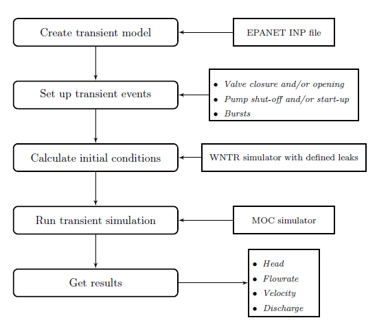

==================================
Transient Modeling Framework
==================================
The framework of performing transient simulation using TSNet is shown in :numref:`flowchart`

.. _flowchart:

   Flowchart of transient simulation in TSNet

The main steps of transient modelling and simulation in TSNet
are described in subsequent sections.

Transient Model
---------------

The transient model inherits the
WNTR water network model [WNTRSi]_,
which includes
junctions, tanks, reservoirs, pipes, pumps, valves,
patterns,
curves,
controls,
sources,
simulation options,
and node coordinates.
It can be built directly from an EPANet INP file.
Sections of EPANet INP file that are not compatible with WNTR are
described in [WNTRSi]_.

Compared with WNTR water network model,
TSNet transient model adds the features
designed specifically for transient simulation, such as
spatial discretization,
temporal discretization,
valve operation rules,
pump operation rules,
burst opening rules, and
storage of time history results.
For more information on the water network model, see
:class:`~tsnet.network.model.TransientModel` in the API documentation.

A transient model can be created directly from an EPANET INP file.
The following example build a transient model.

.. code:: python

    inp_file = 'examples/networks/Tnet1.inp'
    tm = tsnet.network.TransientModel(inp_file)

Initial Conditions
------------------

TSNet employed WNTR [WNTRSi]_ for simulating the steady state
in the network to establish the initial conditions for
the upcoming transient simulations.

**WNTRSimulators** can be used to run demand-driven (DD) or
pressure-dependent demand (PDD) hydraulics simulations, with the
capacity of simulating leaks. The default simulation engine is DD.
An initial condition simulation can be run using the following code:

.. literalinclude:: ../examples/Tnet1_valve_closure.py
    :lines: 22-24

:math:`t_0` stands for the time when the initial condition will be
calculated. More information on the initializer can be found in
the API documentation, under
:class:`~tsnet.simulation.initialize.Initializer`.

Transient Simulation
---------------------------------

After the initial conditions are obtained, TSNet adopts
the Method of Characteristics (MOC)
for solving governing transient flow equations.
A transient simulation can be run using the following code:

.. literalinclude:: ../examples/Tnet1_valve_closure.py
    :lines: 27-28

The results will be returned to the transient model (tm) object,
and then stored in the 'Tnet1.obj' file for the easiness of retrieval.

In the following sections, an overview of the solution approaches
and boundary conditions is presented,
based on the following literature [LAJW99]_ , [MISI08]_, [WYSS93]_.

Governing Equations and Numerical Schemes
""""""""""""""""""""""""""""""""""""""""""

Mass and Momentum Conservation
^^^^^^^^^^^^^^^^^^^^^^^^^^^^^^

The transient flow is governed by the mass and momentum conservation
equation [WYSS93]_:

.. math::
    \frac{\partial H}{\partial t} + \frac{a^2}{g} \frac{\partial V}{\partial x} - gV\sin \alpha = 0

    \frac{\partial V}{\partial t} + g\frac{\partial H}{\partial x} + h_f = 0

where
:math:`H` is the piezometric head,
:math:`V` is the flow velocity in the pipe,
:math:`t` is time,
:math:`a` is the wave speed,
:math:`g` is the gravity acceleration,
:math:`\alpha` is the angle from horizontal,
and :math:`h_f` represents the head loss
(only quasi-steady friction head loss per unit length is modelled in current package).

Method of Characteristics (MOC)
^^^^^^^^^^^^^^^^^^^^^^^^^^^^^^^

The Method of Characteristics (MOC) method is used to solve the system of
governing equations above. The essence of MOC is to transform the set of
partial differential equations to an equivalent set of ordinary differential
equations that apply along specific lines, i.e., characteristics lines
(C+ and C-), as shown below [LAJW99]_:

.. math::
    C+: \frac{dV}{dt} + \frac{g}{a} \frac{dH}{dt} + h_f - gV\sin(\alpha) = 0
    \text{  only when  } \frac{dx}{dt} = a

    C-: \frac{dV}{dt} - \frac{g}{a} \frac{dH}{dt} + h_f - gV\sin(\alpha) = 0
    \text{  only when  } \frac{dx}{dt} = -a

The explicit MOC technique is then adopted to solve the above systems of
equations along the characteristics lines [LAJW99]_.

Headloss in Pipes
^^^^^^^^^^^^^^^^^

TSNet adopts Darcy-Weisbach equation to compute head loss, regardless of the
friction method defined in the EPANET .inp file. This package computes
Darcy-Weisbach coefficients (:math:`f`) based on the head loss
(:math:`{h_f}_0`) and flow velocity (:math:`V_0`) in initial condition,
using the following equation:

.. math::
    f = \frac{{h_f}_0}{(L/D)(V_0^2/2g)}

where
:math:`L` is the pipe length,
:math:`D` is the pipe diameter,
and :math:`g` is gravity acceleration.

Subsequently, in transient simulation the headloss (:math:`h_f`) is calculated
based on the following equation:

.. math::
    h_f = f\frac{L}{D}\frac{V^2}{2g}

Pressure-driven Demand
^^^^^^^^^^^^^^^^^^^^^^^

During the transient simulation in TSNet, the demands are treated as
pressure-dependent discharge; thus, the actual demands will vary from
the demands defined in the INP file.
The actual demands (:math:`d_{actual}`) are modeled based on the
instantaneous pressure head at the node and the demand discharge coefficients,
using the following equation:

.. math::
    d_{actual} = k \sqrt{H_p}

where :math:`H_p` is the pressure head
and :math:`k` is the demand discharge coefficient,
which is calculated from the initial demand (:math:`D_0`)
and pressure head (:math:`{H_p}_0`):

.. math::
    k = \frac{D_0}{\sqrt{{H_p}_0}}

It should be noted that if the pressure head is negative, the demand flow will be
treated zero, assuming that a backflow preventer exists on each node.

Choice of Time Step
"""""""""""""""""""

The determination of time step in MOC is not a trivial task. There are two
constraints that have to be satisfied simultaneously:

1.  The Courant's criterion has to be satisfied for each pipe,
    indicating the maximum time step allowed in the network transient analysis
    will be:

.. math::
    \Delta t \leqslant \min{\left(\frac{L_i}{N_i a_i}\right)} \text{,       }
    i = 1 \text{, } 2 \text{, ..., } n_p

2.  The time step has to be the same for all the pipes in the network, therefore
    restricting the wave travel time :math:`\frac{L_i}{N_ia_i}` to be the same
    for any computational unit in the network. Nevertheless, this is not
    realistic in a real network, because different pipe lengths
    and wave speeds usually cause different wave travel times. Moreover,
    the number of sections in the :math:`i^{th}` pipe (:math:`N_i`) has to
    be an even integer due to the grid configuration in MOC; however, the
    combination of time step and pipe length is likely to produce
    non-integer value of :math:`N_i`, which then requires further adjustment.

This package adopted the wave speed adjustment scheme  [WYSS93]_ to make
sure the two criterion stated above are satisfied.

To begin with, the maximum allowed time step (:math:`{\Delta t}_{max}`) is
calculated, assuming there are two computation segments on the shortest pipe:

.. math::
    \Delta t_{max} = \min{\left(\frac{L_i}{2a_i}\right)} \text{,       }
    i = 1 \text{, } 2 \text{, ..., } n_p

If the user defined time step is greater than :math:`{\Delta t}_{max}`, a
fatal error will be raised and the program will be killed; if not, the
user defined value will be used as the initial guess for the upcoming
adjustment.

.. literalinclude:: ../examples/Tnet1_valve_closure.py
    :lines: 9-11

The determination of time step is not
straightforward, especially in large networks.
Thus, we allow the user
to ignore the time step setting, in which case
:math:`{\Delta t}_{max}` will be used as the initial guess for the upcoming adjustment.

After setting the initial time step, the following adjustments will be performed.
Firstly,
the :math:`i^{th}` pipes (:math:`p_i`) with length (:math:`L_i`) and wave
speed (:math:`a_i`) will be discretized into (:math:`N_i`) segments:

.. math::
    N_i = 2\text{int \left(\frac{L_i}{a_i \Delta t\right)} \text{,       }
    i = 1 \text{, } 2 \text{, ..., } n_p

Furthermore, the discrepancies introduced by the rounding of :math:`N_i`
can be compensated by correcting the wave speed (:math:`a_i`).

.. math::
    \Delta t = \min{\left(\frac{L_i}{a_i(1 \pm \phi_i)N_i}\right)} \text{,       }
    i = 1 \text{, } 2 \text{, ..., } n_p

Least squares approximation is then used to determine :math:`\Delta t`
such that the sum of squares of the wave speed adjustments
(:math:`\sum{{\phi_i}^2}`) is minimized [MISI08]_.
Ultimately, an adjusted
:math:`\Delta t` can be determined and then used in the transient simulation.

It should be noted that even if the user defined time step satisfied the
Courant's criterion, it will still be adjusted.

Boundary Conditions
"""""""""""""""""""

Valve Operations
^^^^^^^^^^^^^^^^^^^^^^^^^^^^^^^^^^^^^

.. Two types of valve are included in TSNet: end valve, located on the boundary
    of a network, and inline valve, located in the middle of the network and
    connected by one pipe on each end.

Valve operations, including closure and opening, are supported in TSNet.
The default valve shape is gate valve, the valve characteristics curve
of which is defined according to [STWV96]_.
The following examples illustrate how to perform valve operations.

Valve closure can be simulated by defining
the valve closure start time (:math:`ts`),
the operating duration (:math:`t_c`),
the valve open percentage when the closure is completed (:math:`se`),
and the closure constant (:math:`m`), which characterizes
the shape of the closure curve.
These parameters essentially define the valve closure curve.
For example, the code below will yield the blue curve
shown in :numref:`valve_closure`.
If the closure constant (:math:`m`) is
instead set to :math:`2`, the valve curve will then correspond to the
orange curve in :numref:`valve_closure`.

.. code:: python

  tc = 1 # valve closure period [s]
  ts = 0 # valve closure start time [s]
  se = 0 # end open percentage [s]
  m = 1 # closure constant [dimensionless]
  valve_op = [tc,ts,se,m]
  tm.valve_closure('VALVE',valve_op)

.. _valve_closure:
.. figure:: figures/valve_closure.png
   :width: 500
   :alt: valve_closure

   Valve closure operating rule

Furthermore, valve opening can be simulated by defining a similar set of
parameters related to the valve opening curve. The valve opening curves
with :math:`m=1` and :math:`m=2` are illustrated in :numref:`valve_opening`.

.. code:: python

  tc = 1 # valve opening period [s]
  ts = 0 # valve opening start time [s]
  se = 1 # end open percentage [s]
  m = 1 # opening constant [dimensionless]
  valve_op = [tc,ts,se,m]
  tm.valve_opening('VALVE',valve_op)

.. _valve_opening:
.. figure:: figures/valve_opening.png
   :width: 500
   :alt: valve_opening

   Valve opening operating rule

Pump Operations
^^^^^^^^^^^^^^^^

The TSNet also includes the capability to perform controlled pump operations
by specifying the relation between pump rotation speed and simulation time.
Explicitly, during pump start-up, the rotational speed of the pump
is increased based on the user defined operating rule.
The pump is then modeled using the two compatibility equations,
a continuity equation, the pump characteristic curve at given rotation speed,
and the affinity laws [LAJW99]_, thus resulting in
the rise of pump flowrate and the addition of mechanical energy.
Conversely, during pump shut-off, as the rotational speed of the pump
decreased according to the user defined operating rule,
the pump flowrate and the addition of mechanical energy decline.
However, pump shut-off due to power failure,
when the reduction of pump rotation speed
depends on the characteristics of the pump (such as inertia),
has not been included yet.

The following example shows how to add pump shut-off event to the network,
where the parameters are defined in the same manner as in valve closure:

.. literalinclude:: ../examples/Tnet2_pump_shutdown.py
    :lines: 13-18

Correspondingly, the controlled pump opening can be simulated using:

.. code:: python

  tc = 1 # pump opening period [s]
  ts = 0 # pump opening start time [s]
  se = 1 # end open percentage [s]
  m = 1 # opening constant [dimensionless]
  pump_op = [tc,ts,se,m]
  tm.pump_start_up('PUMP2',pump_op)

It should be noted that a check valve is assumed in each pump, indicating
that the reverse flow will be prevented immediately.

Leaks
^^^^^^^

In TSNet, leaks and bursts are assigned to the network nodes.
A leak is defined by specifying the leaking node name and the
emitter coefficient (:math:`k_l`):

.. literalinclude:: ../examples/Tnet3_burst_leak.py
    :lines: 15-16

Existing leaks should be included in the initial condition solver
(WNTR simulator);
thus, it is necessary to define the leakage before calculating
the initial conditions.
For more information about the inclusion of leaks in steady state
calculation, please refer to WNTR documentation [WNTRSi]_.
During the transient simulation, the leaking node is modeled
using the two compatibility equations, a continuity equation, and an orifice
equation which quantifies the leakage discharge (:math:`Q_l`):

.. math::
    Q_l = k_l \sqrt{{H_p}_l}

where :math:`{H_p}_l` is the pressure head at the leakage node.
Moreover, if the pressure head is negative, the leakage discharge
will be set to zero, assuming a backflow preventer is installed
on the leakage node.

Bursts
^^^^^^

The simulation of burst and leakage is very similar. They share similar
set of governing equations. The only difference is that the burst opening
is simulated only during the transient calculation and not included in the
initial condition calculation.
In other words, using burst, the user can model new and evolving condition,
while the leak model simulates an existing leak in the system.
In TSNet, the burst is assumed to be developed
linearly, indicating that the burst area increases linearly from zero to
a size specified by the user during the specified time period.
Thus, a burst event can be modeled by defining the start and end time of the
burst, and the final emitter coefficient when the burst
is fully developed:

.. literalinclude:: ../examples/Tnet3_burst_leak.py
    :lines: 19-22

